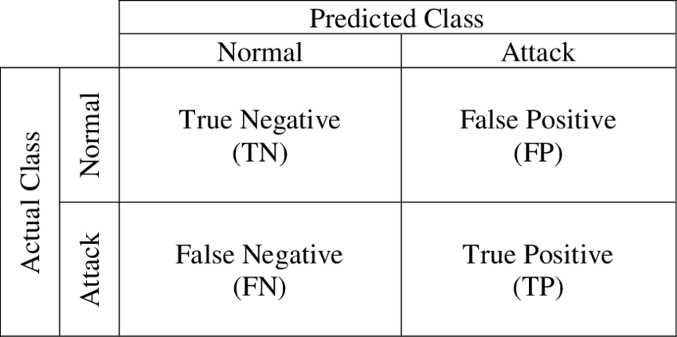
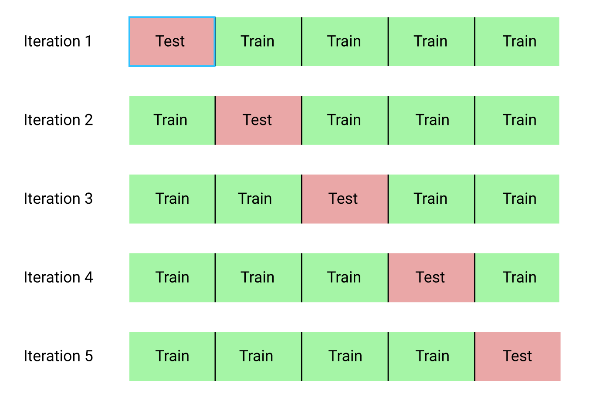

```{r setup, include=FALSE}
library(reticulate)
use_python("C:/Users/Gaede/Anaconda3/")
```


\setcounter{tocdepth}{3}
\renewcommand{\contentsname}{Indice dei contenuti}
\tableofcontents
\newpage

# Il Teorema di Bayes
Il teorema di Bayes proposto da Thomas Bayes, è utilizzato per calcolare la probabilità condizionata di un evento A, sapendo che si è verificato un evento B, a partire dalla conoscenza delle probabilità a priori degli eventi A e B e della probabilità condizionata di B noto A.
Il teorema di Bayes è utilizzato in molti campi, come nella diagnosi medica per calcolare la probabilità che un individuo sia affetto da una malattia sapendo che presenti determinati sintomi.

## Enunciato del teorema di Bayes
Considerando un insieme di variabili aleatorie indipendenti[^1] $A_1, ..., A_n$ che partizionano l'insieme degli eventi $\Omega$, la probabilità condizionata è definita come:
$$P(A_i|B) = \frac{P(B|A_i)P(A_i)}{P(B)} = \frac{P(B|A_i)P(A_i)}{\sum_{j=1}^nP(B|A_j)P(A_j)}$$

[^1]: Dato un insieme di eventi $A_1$, $A_2$, ..., $A_n$, si dicono indipendenti qualora il verificarsi di uno di essi non influisce sul calcolo della probabilità di tutti gli altri.

Dove:

- $P(A_i|B)$: probabilità condizionata di $A_i$ noto B. E' anche conosciuta come probabilità a posteriori visto che dipende dallo specifico valore di B.
- $P(B|A_i)$: probabilità condizionata di B noto $A_i$
- $P(A_i)$: probabilità a priori di $A_i$.
- $P(B)$: probabilità a priori di B, e funge da costante di normalizzazione, che permette di ottenre $P(A_i|B) = 1$ al variare di $i$.

## Naive Bayes
L'espressione Naive Bayes ("ingenuo") indica il fatto che si fanno forti assunzioni di indipendenza nel modello. Si assume infatti che data una certa classe, ciascuna delle variabili aleatorie (features) siano indipendenti.
Formalmente quindi dato un vettore $B=(B_1, ..., B_n)$ si assume che sia verificata:
$$P(B_1, ..., B_n|A) = \prod_{i=1}^{n}P(B_i|A)$$
Questa assunzione di indipendenza però non sempre è verificata nella realtà, motivo per il quale è detto "Naive Bayes". Nonostante ciò, i modelli che utilizzano Naive Bayes funzionano sorprendentemente bene.

Questa particolarità sta a significare che la probabilità a posteriori:
$$P(A|B_1, ..., B_n) \propto P(A)P(B_1|A)...P(B_n|A)$$

Il teorema può essere rivisto in diverse maniere a seconda della distribuzione di probabilità delle varie variabili aleatorie.

### Naive Bayes: distribuzione di Bernoulli

Il torema di Bayes può essere rivisto prendendo in considerazione variabili aleatorie con distribuzione di Bernoulli[^2].
In questo caso sia $B=(B_1, ... B_n)$ con $B_1, ... B_n \sim B(p)$ e $p \in [0, 1]$.
Si è quindi in presenza di variabili aleatorie binarie.
In questo caso la verosomiglianza può essere calcolata con:

$$P(B|A) = \prod_{i=1}^nP(B_i|A)^{x_i}(1-P(B_i|A))^{(1-x_i)}$$
Dove $xi$ è un valore booleano che esprime presenza o assenza.

[^2]: Una variabile aleatoria discreta X ha distribuzione di Bernoulli $B(p)$ con $p \in [0, 1]$ se e solo se $P(X = i) = p^i(i-p)^{1-i}$

Questo modello è molto popolare nei task di classificazione testuale, dove le occorrenze dei termini nei documenti vengono descritte mediante valori booleani presente/assente.

### Naive Bayes: distribuzione Multinomiale
Se si trattano variabili aleatorie con distribuzione Multinomiale[^3], la verosomiglianza può essere calcolata come: 
$$P(B|A) = \frac{\Sigma_ix_i!}{\Pi_ix_i!}\prod_{i}^nP(B_i|A)^{x_i}$$
Dove $x=(x_1, ..., x_n)$, e $x_i$ conta il numero di volte in cui l'evento i si verifica in una particolare istanza.
Questo modello è usato tipicamente per classificazione di documenti, i cui eventi rappresentano le occorrenze di un termine in un singolo documento.

[^3]: Un insieme di variabili aleatorie indipendenti $B_1, ..., B_n$ hanno distribuzione Multinomiale se e solo se $\frac{\Sigma_ix_i!}{\Pi_ix_i!}\prod_{i}^np_i^{x_i}$ dove $x_i$ è il numero di volte in cui l'evento si verifica e $p_i$ è la probabilità con cui esso si verifica.

\textbf{Nota bene}: se una data classe e un dato termine non occorrono mai nei dati a disposizione, allora la probabilità stimata sarà zero. Questo perchè la probabilità stimata è direttamente proporzionale al numero di occorrenze dei valori di una feature.
Questo potrebbe rappresentare un problema perchè se un termine non occorre mai nei documenti di una data classe, allora la probabilità che il documento appartenga a quella classe sarà automaticamente zero. Per questo motivo è spesso conveniente incorporare una correzione. Si introduce così una tecnica nota come \textbf{Laplace Smoothing}.

## Laplace smoothing
Data una osservazione $x=(x_1, ..., x_d)$ da una distribuzione multinomiale con N campioni e il vettore $\theta = (\theta_1, ..., \theta_d)$, una versione "smoothed" dei dati dato lo stimatore:
$$\hat{\theta} = \frac{x_i+\alpha}{N+\alpha d}$$
Dove $\alpha>0$ è il parametro di "smoothing".
Nelle applicazioni di classificazione testuale solitamente si pone $\alpha=1$, ed in questo caso la tecnica prende il nome di *Laplace Smoothing*.

## Vantaggi e svantaggi di Naive Bayes
### Vantaggi
- Rapido e richiede poca memoria
- Robusto sulle feature irrilevanti: le feature irrilevanti non influiscono sui risultati
- Molto performante in domini con features equalmente importanti
- Ottimo se utilizzato sotto assunzione di indipendenza delle features

### Svantaggi
- L'algoritmo richiede la conoscenza di tutti i dati del problema. In particolar modo delle probabilità semplici e condizionate. Spesso sono informazioni difficili e costose da ottenere.
- L'algoritmo fornisce un'approssimazione "ingenua" (naive) del problema perché non considera la correlazione tra le caratteristiche dell'istanza.

\newpage

# Classificazione Testuale e Naive Bayes

La classificazione del testo è un'attività che si occupa di classificare testi digitali espressi in lingua naturale, assegnando in maniera automatica collezioni di documenti ad una o più classi appartenenti ad un insieme di classi predefinito.

Per realizzare ciò si utilizzano degli approcci di apprendimento automatico, dove è necessario addestrare il sistema tramite apprendimento di esempi, da cui generare un modello generale per la classificazione automatica. Esistono tuttavia altri approcci, come quello non supervisionato.

In questo progetto si è interessati all'apprendimento supervisionato.
Si suppone di disporre di:

- Un set di documenti $D=\{d_1, d_2, ..., d_n\}$, dove ciascun documento $d_i$ è composto da un insieme di termini $T_i=\{t_1, t_2, ..., t_m\}$
- Un set di classi $C=\{c_1, c_2, ..., c_k\}$
- Un insieme di coppie $(d_p, c_z)$ dove $1 \leq p \leq n$ e $1 \leq z \leq k$, dove $n$ è il numero totale di documenti e $z$ è il numero totale di classi.

Il task di classificazione si pone come obiettivo quello di addestrare un classificatore che, dato un generico documento sconosciuto $d$, predica la classe di appartenenza $c \in C$. Il classificatore si può interpretare come una funzione $\gamma:D \rightarrow C$

## Step 1: Bag of Words
Il primo step consiste nella creazione di un modello *bag of words*, utilizzato nell'Information Retrieval e nell'elaborazione del linguaggio naturale per rappresentare i documenti ignorando l'ordine delle parole, consentendo una gestione basata su liste.
Durante questo step ciascun documento viene processato per creare una rappresentazione maggiormente adeguata per il task di classificazione testuale.
Il modello bag of words, solitamente viene costruito dopo i seguenti processi:

- \textbf{Tokenizzazione}: segmentazione del testo in parole singole
- \textbf{Rimozione delle stopwords}: rimozione dei termini non informativi come gli articoli, congiunzioni, valori numerici, simboli, ecc.
- \textbf{Stemming}: si riportano tutti i termini alla propria radice. Ad esempio: studies -> studi, studying -> study
- \textbf{Lemmatizzazione}: prende in considerazione l'analisi morfologica della parola. Per fare ciò è necessario un dizionario dettagliato che l'algoritmo può utilizzare per riportare il termine al suo lemma. Il dizionario più comune è \textbf{WordNet}.

Di seguito viene riportato un banale esempio di rappresentazione bag of words:

\begin{center}
\begin{tabular}{ |c|c| }
  \hline
  term & frequency \\ \hline
  great & 2 \\ \hline
  love & 2 \\ \hline
  recommend & 1 \\ \hline
  laugh & 1 \\ \hline
  happy & 1 \\ \hline
\end{tabular}
\end{center}

## Step 2: Costruzione della matrice term-doc
I classificatori e gli algoritmi di apprendimento non possono processare direttamente il testo nella sua forma originale, poichè la maggior parte di essi prevede l'utilizzo di vettori numerici con dimensioni fisse anzicchè vettori di testo con lunghezza variabile.
Pertanto, durante questa fase, i testi vengono convertiti in una rappresentazione più adeguata per gli obiettivi prefissati.
Un approccio comune per l'estrazione di features dal testo è l'uso del modello *bag od words* descritto nello step precedente.

Vi sono due modi per realizzare una matrice termini-documenti.
Fissato un documento $d_i$ e un termine $t_j$, nel primo approccio si pone in posizione $(i,j)$ della matrice il valore $1$ se il termine $t_j$ compare nel documento $d_i$, 0 altrimenti.
Questo primo approccio risulta essere il più semplice, ma allo stesso tempo meno performante rispetto al secondo.

Per poter descrivere il secondo approccio di costruzione della matrice termini-documenti, si fa riferimento a due misure denominate \textbf{term frequency} e \textbf{inverse document frequency}.

- \textbf{term frequency}: è la frequenza di un termine all'interno di un documento. Molto spesso però una parola può essere utilizzata troppo spesso, e per questo motivo si potrebbe avere la necessità di ridurre l'influenza di tale parola, e per questo motivo si utilizza il sublinear \textbf{term frequency}, definito come il logaritmo del TF:
$$log(tf)$$
- \textbf{inverse document frequency}: tutti i task che fanno riferimento al natural language processing soffrono di un problema: tutti i termini sono considerati ugualmente importanti, ma si è sempre in presenza di termini che risultano essere più informativi rispetto ad altri. Ad esempio, tutti gli articoli che parlano di _business_ potrebbero presentare molto spesso la parola _"denaro"_, che essendo presente troppe volte, avrebbe poco potere informativo.
Per risolvere tale problematica si introduce un meccanismo per attenuare l'effetto dei termini che si verificano troppo spesso nella raccolta di documenti, che si chiama IDF, ed è definito come:
$$IDF = \log(\frac{N}{df_t})$$
Dove:

- \textbf{N}: è il numero di documenti nella collezione.
- \textbf{$df_t$}: è il numero di documenti che contengono il termine t.

Avendo definito \textbf{TF} e \textbf{IDF} è ora possibile introdurre il concetto di \textbf{TF-IDF}, dato da:
$$TFIDF = TF*IDF = \log(tf)*\log(\frac{N}{df_t})$$
Detto ciò può essere realizzata una matrice termini-documenti più sofisticata, dove vengono disposti i documenti sulle righe, e i termini sulle colonne.
In questo caso, l'elemento in posizione $(i,j)$ sarà:

- \textbf{0}: se il termine non è presente nel documento
- \textbf{TF-IDF}: il termine è presente nel documento


## Step 3: Naive Bayes per la Classificazione Testuale
In questo step per i vari calcoli di probabilità ci si avvale della matrice termini-documenti descritta durante lo Step 2.
Siano definiti un generico documento d $\in$ D e una generica classe c $\in$ C.
La probabilità che la classe c faccia riferimento al documento d è definita dal teorema di Bayes: $$P(c|d)=\frac{P(d|c)P(c)}{P(d)}$$
Dove:

- $P(d|c)$ è detta probabilità condizionata del documento d, data la classe c.
Il valore di questa probabilità dipende dall'assunzione sul tipo di distribuzione che essa possiede.

  - \textbf{Bernoulli Naive Bayes}: da utilizzarsi quando la matrice termini-documenti è composta dai soli elementi 0 (termine assente nel documento) e 1 (termine presente nel documento).
In questo caso, la probabilità condizionata del documento $d = (t_1, ..., t_m)$ data la classe $c$ risulta seguire:
$$p(d|c) = \prod_{i=1}^mP(t_i|c)^{x_i}(1-P(t_i|c))^{(1-x_i)}$$
Dove $x_i$ è un valore che esprime presenza o assenza del termine $t_i$ nel documento $d$.

  - \textbf{Multinomial Naive Bayes}: da utilizzarsi quando la matrice termini-documenti contiene la frequenza dei termini nei documenti o alternativamente il TF-IDF.
Sia $x$ il vettore per il documento $d$. L'elemento *i-esimo* del vettore x, corrisponde alla frequenza (o al tf-idf) del termine $t_i$ nel documento $d$.
In questo caso la probabilità condizionata del documento $d = (t_1, ..., t_m)$ data la classe $c$ risulta seguire:
$$P(d|c) = \frac{\Sigma_ix_i!}{\Pi_ix_i!}\prod_{i}P(t_i|c)^{x_i}$$
Il termine di normalizzazione $\frac{\Sigma_ix_i!}{\Pi_ix_i!}$ in questo caso non sarà utilizzzato perchè non dipende dalla classe.
Pertanto si può dire che:
$$p(d|c) \propto \prod_{i}P(t_i|c)^{x_i}$$
A questo punto si può definire:
$$P(t_i|c)=\frac{count(t_i,c)}{\Sigma_{t \in V}count(t, c)}$$
Quindi, la probabilità che il documento $d$ appartenga alla classe $c$ può essere scritta come definito in precedenza.

- $P(c)$ è la probabilità a priori di c
$$P(c)=\frac{docCount(c)}{N_{doc}}$$
- $P(d)$ è la probabilità a priori di d

Al variare della classe c, si è interessati alla \textbf{MAP}, ovvero \textbf{"maximum a posteriori"}, cioè al:
$$argmax_{c \in C} P(c|d) = argmax_{c \in C} \frac{P(d|c)P(c)}{P(d)} \propto argmax_{c \in C} P(d|c)P(c) = $$
$$= argmax_{c \in C} P(t_1, t_2, ..., t_m|c)P(c)$$

Attenzione: valgono le seguenti assunzioni:

- Si assume che la posizione dei temrini non è importante
- Si assume che le probabilità $P(t_i|c_j)$ sono indipendenti data la classe c.
$$P(t_1, t_2, ..., t_m | c) = P(t_1|c)*...*P(t_m|c)$$

Quindi la MAP può essere descritta come: $$argmax_{c \in C} P(t_1, t_2, ..., t_m|c)P(c) = argmax_{c \in C} P(c)\prod\limits_{t \in d}P(t|c)$$

\newpage

# Metodi di valutazione
## Accuracy
L'accuratezza misura l'insieme di etichette predette da un campione rispetto alle etichette reali. Il valore dell'accuratezza varia nell'intervallo $[0, 1]$, dove 0 indica una scarsa accuratezza, ed 1 indica una buona accuratezza.
Tale misura rappresenta quindi la percentuale di istanze correttamente classificate, ed è definita come:
$$\frac{\sum_{i}c_{ii}}{\sum_{j}\sum_{i}c_{ij}}$$

## Matrice di confusione
Uno dei metodi più semplici e rappresentativi per valutare la bontà di un classificatore è la matrice di confusione.
Essa mette in contrapposizione gli output reali con gli output predetti dal classificatore, in modo da poterne studiare la bontà.
Un classificatore ideale dovrebbe presentare valori diversi da zero solo sulla diagnola principale della matrice.
Nel caso bivariato la matrice di confusione avrebbe dimensione $2x2$, la matrice di confusione può essere interpretata come:

```{r, echo = FALSE, fig.cap="Matrice di confusione 2x2", fig.align='center', out.width = '50%'}

```
Dove:

- \textbf{TP (true positive)}: istanze classificate come "1" in modo corretto
- \textbf{FP (false positive)}: istanze classificate come "1" in modo errato
- \textbf{FN (false negative)}: istanze classificate come "0" in modo errato
- \textbf{TN (true negative)}: istanze classificate come "0" in modo corretto

## Kappa Di Cohen
E' un coefficiente statistico che rappresenta il grado di accuratezza e affidabilità in una classificazione statistica.
$$K = \frac{Pr(a)-Pr(e)}{1-Pr(e)}$$
Dove:

- $Pr(a)$: è data dal rapporto tra la somma degli elementi posti sulla diagonale principale della matrice di confusione e il numero totale di esempi. Rappresenta la percentuale di giudizio concorde.
- $Pr(e)$: nel caso di matrici di confusione bidimensionali è data da: $(\frac{TP+FP}{N}*\frac{TP+TN}{N})+(\frac{TN+FN}{N}*\frac{FP+FN}{N})$ e rappresenta la probabilità di raggiungere casualmente un accordo.

I valori di questa statistica sono: $-1\leq k\leq1$, dove:

- Se $k<0$: non c'è concordanza
- Se $k=1$: concordanza perfetta

Ovviamente si preferiscono valori di k prossimi ad 1.

## Cross Validation
La cross validation è una tecnica statistica utilizzabile in presenza di una buona numerosità del campione osservato, quindi, in presenza di un gran numero di documenti.
In particolare, la corss validation consiste nella suddivisione dell'insieme di dati totale in $k$ parti di uguale numerosità, e ad ogni passo, la k-esima parte viene utilizzata come insieme di convalida, mentre le restanti parti costituiscono il training set.

Così facendo si allena il modello per ognuna delle k parti, evitando problemi di *overfitting*.
In altre parole, si suddivide il campione osservato in gruppi di egual numerosità, si esclude iterativamente un gruppo alla volta e si cerca di predirlo utilizzando i gruppi non esclusi, al fine di verificare la bontà del modello di predizione utilizzato.


```{r, echo=FALSE, fig.cap="Cross Validation con 5 Folds", fig.align='center', out.width = '70%'}

```


\newpage
# Realizzazione
Dopo aver affrontato Naive Bayes e la classificazione testuale dal punto di vista teorico è stato costruito un classificatore Naive Bayes utilizzando il linguaggio Python ed R.
Per realizzare un progetto verosimile è stato preso in considerazione un dataset reale, descritto nel paragrafo successivo.

## Descrizione del dataset
Il dataset utilizzato per la realizzazione di questo progetto è denominato *BBC News Classification*[^4].

[^4]: BBC News Classification: https://www.kaggle.com/c/learn-ai-bbc/data

All'interno dell'archivio sono presenti i seguenti file:

- \textbf{BBC News Train.csv}: utilizzato per i task di apprendimento supervisionato.
Il dataset è composto da 1490 istanze e 3 features:
  - \textbf{ArticleId}: identificativo dell'articolo
  - \textbf{Article}: testo dell'articolo
  - \textbf{Category}: categoria di appartenenza dell'articolo (*tech*, *business*, *sport*, *entertainment*, *politics*).
- \textbf{BBC News Test.csv}: da utilizzarsi per i task di apprendimento non supervisionato.
Composto da 736 istanze e 2 features:
  - \textbf{ArticleId}: identificativo dell'articolo
  - \textbf{Article}: testo dell'articolo
- \textbf{BBC News Sample Solutions.csv}: contiene i risultati di classificazione.

Il dataset che più si addice agli scopi di questa analisi risulta essere *BBC News Train.csv*, pertanto tutti gli altri file saranno ignorati.


## Python
### Import delle librerie
Questo task di classificazione si è deciso di affrontarlo mediante l'utilizzo della libreria \textbf{sklearn}, che incorpora al suo interno gli strumenti per la costruzione dei classificatori Naive Bayes necessari.
Sono state importate inoltre altre librerie come \textbf{pandas} e \textbf{numpy} per la creazione di DataFrame e Series e \textbf{pyplot} e \textbf{seaborn} per il plot di alcuni grafici.

Per pulizia nei successivi chunks di codice si importano tutte le librerie necessarie.
```{python}
import pandas as pd
import numpy as np

from io import StringIO

from matplotlib import pyplot as plt
import seaborn as sns
from IPython.display import display

from sklearn.feature_selection import chi2
from sklearn.metrics import confusion_matrix
from sklearn.model_selection import train_test_split
from sklearn.feature_extraction.text import CountVectorizer
from sklearn.feature_extraction.text import TfidfTransformer
from sklearn.feature_extraction.text import TfidfVectorizer
from sklearn.naive_bayes import MultinomialNB
from sklearn.naive_bayes import BernoulliNB
from sklearn.naive_bayes import GaussianNB
from sklearn.model_selection import cross_val_score

from nltk.stem.porter import PorterStemmer
import nltk
import string
```

### Caricamento in memoria del dataset
A questo punto si è pronti per caricare in memoria il dataset *BBC News Train.csv* utilizzando un DataFrame.
```{python}
df = pd.read_csv('./BBC News Train.csv', sep=',')
```

### Analisi esplorativa del dataset
Si è condotta una fase di analisi esplorativa del dataset al fine di comprenderne la natura e di eseguire una buona successiva fase di pre-processing.

E' stato conteggiato il numero di valori unici per *Category*, mostrata la dimensione dataset, controllato se vi sono valori nulli o duplicati.
Di seguito vengono riportate le operazioni eseguite.

Si osservano i valori unici della feature "Category".
```{python}
df.Category.unique()
```

```{python}
df.head()
```

Si osserva la dimensione del dataset
```{python}
df.shape
```

Se il risultato del chunk seguente è *False*, allora non vi sono esempi con valori nulli in corrispondenza di ciascuna feature.
```{python}
df.isnull().any().any()
```

```{python}
df.info()
```

Si analizzano poi i valori unici per ogni feature:
```{python}
for col in df.columns.values:
    print(f"Il numero dei valori unici (non ripetuti) di {col} è: {df[col].nunique()}")
```

Dal precedente chunk si evince che vi sono valori di Text ripetuti più volte.
Probabilmente lo stesso articolo è stato pubblicato più volte con un diverso identificativo. Per tale ragione, in fase di pre-processing (in seguito) si è deciso di rimuovere i duplicati per non peggiorare le performance del classificatore.

Si realizza un barplot per osservare graficamente la distribuzione degli esempi all'interno delle 5 diverse categorie.
```{python}
import os
os.environ['QT_QPA_PLATFORM_PLUGIN_PATH'] = 'C:/Users/Gaede/Anaconda3/Library/plugins/platforms'

sns.countplot(data = df, x="Category")
plt.show()
```

### Preprocessing
Successivamente è stata condotta una fase di pre-processing, al fine di preparare il dataset per il task di classificazione testuale.
Le operazioni svolte durante questa fase sono state:

- Rimozione degli articoli duplicati scoperti durante l'analisi esplorativa
```{python}
df.drop_duplicates(subset ="Text", 
                     keep = "first", inplace = True)
df.shape
```

- Rimozione della feature *ArticleId* poichè ritenuta inutile ai fini del task di classificazione testuale.
```{python}
del df["ArticleId"]
```

- Aggiunta della feature *category_id*, ottenuta a partire dalla feature *Category* mediante l'applicazione di una tecnica conosciuta come *label encoding*.
```{python}
df['category_id'] = df['Category'].factorize()[0]
df.head()
```

### Costruzione della matrice termini-documenti
Mediante il meotodo TfidfVectorizer messo a disposizione da Python, è stata realizzata la matrice termini-documenti *termDoc*.
Questo metodo prende in input:

- \textbf{sublinear\_tf}: impostato a *True* se si desidera il calcolo del sublinear TF
- \textbf{min\_df}: numero minimo di documenti in cui un termine deve essere presente. In questo caso è stato impostato pari a 10.
- \textbf{norm}: settata a *l2* per assicurarsi che i vettori abbiano norma Euclidea.
- \textbf{encoding}: standard di codifica utilizzato
- \textbf{stop\_words}: settato a *english* per consentire l'eliminazione delle paroli più comuni come 'a', 'the', 'that', ecc. Si sceglie di rimuovere questi termini perchè possiedono poco potere informativo, quindi risultano essere non discriminanti.
- \textbf{token\_pattern}: regex che consente di scegliere quali termini prendere in considerazione. Si è scelta come regex, l'espressione "[A-Za-z][A-Za-z]+" per prendere in considerazione i soli termini che contengono caratteri alfebetici e composti da almeno due lettere.
- \textbf{tokenizer}: prende in input la funzione *tokenize* che esegue lo stemming dei termini.

```{python}
stemmer = PorterStemmer()
trans_table = {ord(c): None for c in string.punctuation + string.digits}
def tokenize(text):
    tokens = [word for word in nltk.word_tokenize(text.translate(trans_table)) if len(word) > 2] 
    stems = [stemmer.stem(item) for item in tokens]
    return stems
    
tfidf = TfidfVectorizer(sublinear_tf=True, min_df=10, norm='l2', encoding='latin-1',
  stop_words='english', token_pattern='[A-Za-z][A-Za-z]+', tokenizer=tokenize)
termDoc = tfidf.fit_transform(df.Text).toarray()
labels = df.category_id
print("Dimensione della matrice termini-documenti: ", termDoc.shape)
```

### Definizione del metodo executeNB()
Di seguito viene definito il metodo executeNB utilizzato per addestrare e valutare differenti classificatori bayesiani.
Il metodo prende in input:

- \textbf{termDoc}: matrice termini-documenti
- \textbf{labels}: etichette delle classi
- \textbf{df}: dataFrame contenente il dataset
- \textbf{model}: modello da addestrare 

Il metodo divide i dati a disposizione in:

- Train set: 70%
- Test set: 30%
Attraverso il test set è possibile predire le classi di appartenenza dei documenti appartenenti a tale insieme, per poi confrontare i risultati ottenuti con quelli reali.
In questo modo è possibile valutare la bontà del classificatore appena costruito mediante *Accuracy* e *Matrice di confusione* (descritte in precedenza).

Viene anche realizzato un *countplot* per osservare le differenze di classi predette e reali, e vengono mostrati a video anche gli errori commessi

```{python}

def executeNB(termDoc, labels, df, model):
    # DataFrame che mantiene una corrispondenza 1:1 tra Category e category_id (senza duplicati)
    category_id_df = df[['Category', 'category_id']].drop_duplicates().sort_values('category_id')
    # Dizionario composto da coppie (Category, category_id)
    category_to_id = dict(category_id_df.values)
    # Dizionario composto da coppie (category_id, Category)
    id_to_category = dict(category_id_df[['category_id', 'Category']].values)
    
    model = model(alpha=1) #alpha = 1 per realizzare Laplace Smoothing
    X_train, X_test, y_train, y_test, indices_train, indices_test = train_test_split(
      termDoc, labels, df.index, test_size=0.30, random_state=1, shuffle=True)
    model.fit(X_train, y_train)
    y_pred = model.predict(X_test)

    conf_mat = confusion_matrix(y_test, y_pred)
    fig, ax = plt.subplots(figsize=(10,10))
    sns.heatmap(conf_mat, annot=True, fmt='d', xticklabels=category_id_df.Category.values,
      yticklabels=category_id_df.Category.values)
    plt.ylabel('Actual')
    plt.xlabel('Predicted')
    plt.show()
    
    #Stampa del valore di accuracy
    from sklearn.metrics import accuracy_score
    print("Accuracy: ", accuracy_score(y_test,y_pred))
    
    #Creazione del countplot
    pred_plt = list()
    for n in y_pred:
        pred_plt.append(id_to_category[n])
    
    df_plot = pd.DataFrame({"value": pred_plt,
                            "Class": ["Predicted" for x in pred_plt]})
    
    test_plt = list()
    for n in y_test:
        test_plt.append(id_to_category[n])
        
    df_plot = df_plot.append(pd.DataFrame({"value": test_plt,
                            "Class": ["Real" for x in test_plt]}))
    
    sns.countplot(x="value", hue="Class", data = df_plot)
    plt.title("Predicted vs Real")
    plt.show()
    
    # Stampa a video degli errori di classificazione commessi
    for predicted in category_id_df.category_id:
        for actual in category_id_df.category_id:
            if predicted != actual and conf_mat[actual, predicted] >= 1:
                print("'{}' predicted as '{}' : {} examples.".format(id_to_category[actual],
                  id_to_category[predicted], conf_mat[actual, predicted]))
                display(df.loc[indices_test[(y_test == actual) & 
                  (y_pred == predicted)]][['Category', 'Text']])
                print('')

```

### Costruzione del modello Multinomial Naive Bayes
Disponendo di una matrice termini-documenti costruita secondo il criterio del TF-IDF, si ritiene che il modello più appropriato per questa applicazione sia il Multinomial Naive Bayes perchè le pesature TF-IDF seguono l'andamento di una distribuzione Multinomiale.

Si costruisce e valuta quindi il classificatore Naive Bayes Multinomiale con la matrice term-doc con pesatura TF-IDF:
```{python, fig.align='center', out.height='70%'}
executeNB(termDoc, labels, df, MultinomialNB)
```

### Costruzione del modello Bernoulli Naive Bayes
Oltre che il modello Naive Bayes Multinomiale, si è costruito un modello Naive Bayes Bernoulliano.
Per fare questo però si è convertita la matrice termini-documenti con pesi TF-IDF in una normale matrice contenente fissati $i$ e $j$:

- 1 se il termine i-esimo è presente nel documento j-esimo
- 0 se il termine i-esimo nonè presente nel documento j-esimo

Questa matrice è versione meno precisa della precedente, ma risulterà utile per comparare i vari modelli.

```{python, fig.align='center', out.height='70%'}
# Si binarizza la matrice termDoc con pesature Tf-IDF
termDoc_bin = [np.where(x > 0, 1, 0) for x in termDoc]
executeNB(termDoc_bin, labels, df, BernoulliNB)
```

### Estensioni

#### Comparazione dei modelli

Di seguito viene definito un metodo atto al confronto di diversi modelli, ovvero:

- Bernoulli Naive Bayes
- Multinomial Naive Bayes
- Gaussian Naive Bayes

Quest'ultimo è stato introdotto per mostrare come potrebbero peggiorare le prestazioni del classificatore assumendo (erroneamente) che i dati abbiano una distribuzione Gaussiana.
In questo caso infatti, ci si aspetta di ottenere prestazioni peggiori per il classificatore Gaussiano. Questo perchè non è detto che la distribuzione dei dati assunta dalla matrice term-doc pesata con tf-idf, segua un andamento Gaussiano.

Ogni classificatore viene valutato utilizzando la tecnica nota come *cross validation*, con un numero di *fold* pari a 5.

```{python}
def compareMethods(termDoc, labels):
    models = [
        BernoulliNB(),
        MultinomialNB(),
        GaussianNB(),
    ]

    CV = 5
    entries = []
    for model in models:
        model_name = model.__class__.__name__
        accuracies = cross_val_score(model, termDoc, labels, scoring='accuracy', cv=CV)
        for fold_idx, accuracy in enumerate(accuracies):
            entries.append((model_name, fold_idx, accuracy))
    cv_df = pd.DataFrame(entries, columns=['model_name', 'fold_idx', 'accuracy'])
    print(cv_df.groupby('model_name').accuracy.mean())
```

```{python}
print("Accuracy dei modelli con la matrice termDoc pesata con TF-IDF")
compareMethods(termDoc, labels)
print("Accuracy dei modelli con la matrice termDoc binarizzata")
compareMethods(termDoc_bin, labels)
```


#### Test $\chi^2$
E' stato utilizzato un test $\chi^2$ per trovare i termini che sono più correlati ad ogni categoria di documento.
Nel seguente chunk di codice vengono calcoalte le statistiche chi-quadro tra ciascuna feature e la classe.
Questo score può essere utilizzato per selezionare le n_features con i valori più alti per il test chi-quadro.

Il test proposto misura la dipendenza tra le variabili, quindi l'uso di questa funzione "elimina" le features che hanno maggiori probabilità di essere indipendenti dalla classe, e quindi irrilevanti per la classificazione.

Si ricorda che:
$$\chi^2 = \sum_{i=1}^n\frac{o_ie_i}{e_i}$$
Dove, fissato un indice $i$:

- $o_i$: valori osservati per l'i-esimo esempio
- $e_i$: valori attesi per l'i-esimo esempio

Il metodo prende in input la matrice *termDoc* e un vettore target y contenente l'id della classe per la quale si vuole eseguire il test.

Se le frequenze osservate coincidono con quelle teoriche, allora $\chi^2 = 0$, mentre se differiscono, $\chi^2 > 0$. Ovviamente più grande è il valore di $\chi^2$, più grande è la discrepanza tra le frequenze osservate e quelle teoriche.


```{python}
# DataFrame che mantiene una corrispondenza 1:1 tra Category e category_id (senza duplicati)
category_id_df = df[['Category', 'category_id']].drop_duplicates().sort_values('category_id')
# Dizionario composto da coppie (Category, category_id)
category_to_id = dict(category_id_df.values)
# Dizionario composto da coppie (category_id, Category)
id_to_category = dict(category_id_df[['category_id', 'Category']].values)

nTerms = 5
for category, category_id in sorted(category_to_id.items()):
    termDoc_chi2 = chi2(termDoc, labels == category_id)
    indices = np.argsort(termDoc_chi2[0])
    feature_names = np.array(tfidf.get_feature_names())[indices]
    print(f"Class '{category}': {', '.join(feature_names[-nTerms:])}")
```

Dai risultati sopra mostrati è possibile osservare quali sono i termini più correlati rispetto a ciascuna classe.

#### Classificazione Testuale non supervisionata
In precedenza si è trattato un caso di classificazione testuale supervisionato perchè si disponeva delle etichette di classe.
Come ci si dovrebbe comportare se non si disponesse di queste informazioni?
La risposta ovviamente, risiede nell'utilizzo di algoritmi di classificazione differenti, orientati all'apprendimento non supervisionato.

Successivamente viene rapidamente trattato un esempio di classificazione non supervisionata utilizzando l'algoritmo K-Means.

Si suppone di conoscere a priori il numero delle etichette di classe, pertanto si è lanciato l'algoritmo con n_clusters=5 (#classi = 5).

```{python}
#Si addestra il classificatore KMeans
from sklearn.cluster import KMeans
from sklearn.metrics import accuracy_score

true_k = 5
labels = labels.values
X_train, X_test, y_train, y_test= train_test_split(
      termDoc, labels, test_size=0.30, random_state=0, shuffle=True)
model = KMeans(n_clusters=5, init='k-means++', max_iter=100, n_init=1)
model.fit(X_train)
y_pred = model.predict(X_test)
print('Accuracy: {}'.format(accuracy_score(y_test, y_pred)))

order_centroids = model.cluster_centers_.argsort()[:, ::-1] #in ordine decrescente
terms = tfidf.get_feature_names()

#Si stampano a video i centroidi per ciascun cluster
for i in range(true_k):
    print("Cluster %d:" % i)
    for ind in order_centroids[i, :10]:
        print(" %s" % terms[ind], end=" ") #mostro i termini con tf-idf maggiore
    print("")
```

Dai valori ottenuti, nonostante lo scarso valore di accuracy rispetto agli altri modelli visti, è possibile intuire abbastanza facilmente a quale classe ciascun cluster fa riferimento.
E' probabile (dipende dall'esecuzione di K-Means) che i termini stampati a video, che corrispondo ad alcuni elementi del centroide, corrispondano a quelli generati dal test $\chi^2$.
Questo perchè $\chi^2$ restituisce i termini più rilevanti per ciascuna classe, ed è molto probabile che tali termini possano appartenere al centroide, ovvero il miglior rappresentante per quel cluster.


Ovviamente l'algoritmo K-Means non è l'unico implementabile per questi scopi.
In letteratura sono noti molti altri algoritmi, come E-M.

### Risultati
Dai risultati ottenuti con l'esecuzione del metodo compareMethods si evince che:

- Il modello \textbf{Naive Bayes Multinomiale} risulta funzionare piuttosto bene con la matrice term-doc con pesatura tf-idf. Le sue prestazioni peggiorano nell'ordine dei millesimi con la matrice binarizzata, ma anche in questo caso si ritiene che i risultati siano convincenti, sebbene sarebbe pratica più corretta utilizzare un classificatore Naive Bayes Bernoulliano.
- Il modello \textbf{Naive Bayes Bernoulliano} risulta funzionare allo stesso modo con ambe le matrici. Questo perchè nel caso della matrice con pesatura TF-IDF, il classificatore binarizza automaticamente le feature se riceve in input dati non binari. Tuttavia in entrambi i casi le sue prestazioni risultano essere inferiori rispetto al classificatore Multinomiale.
- Il modello \textbf{Naive Bayes Gaussiano} risulta essere il peggiore tra quelli testati, anche se la sua accuratezza non è un risultato da disprezzare. Tale peggioramento è dovuto al fatto che in entrambi i casi, i dati non seguono una distribuzione di tipo Gaussiano.

In conclusione, si può affermare l'ottenimento di buoni risultati di accuracy per ciascuno dei modelli testati.

Il seguente progetto è stato esteso mediante la realizzazione di un test $\chi^2$ per mostrare i termini più rilevanti per ogni categoria di documento.
Il test scarta i termini che hanno maggiori probabilità di essere indipendenti dalla classe di appartenenza, e che risultano quindi poco informativi per il task di classificazione.

Successivamente è stato mostrato un esempio di algoritmo non supervisionato con lo stesso dataset privato dalle etichette di classe.
L'algoritmo utilizzato è stato il K-Means, i cui risultati sono decisamente deludenti a causa dell'attività di apprendimento non supervisionata.
Esistono tuttavia algoritmi probabilmente più performanti per l'estrazione di topic.


## R
In questo paragrafo sono stati costruiti gli stessi classificatori visti in Python, utilizzando il linguaggio R.

L'analisi esplorativa non è stata ripetuta perchè ci si aspetta gli stessi risultati ottenuti in Python e per non rendere prolissa la documentazione.

### Import delle librerie
```{r message=FALSE}
library(tidyverse)
library(magrittr)
library(tm)
library(naivebayes)
library(gmodels)
require(caret)
```

### Caricamento in memoria del dataset
Si è caricato in memoria il dataset *BBC News Train.csv* utilizzando un data.frame.
```{r}
df<- read.csv('./BBC News Train.csv')
```

### Preprocessing
Esattamente come nel paragrafo precedente è stata condotta la fase di pre-processing, al fine di preparare il dataset per il task di classificazione testuale.
Anche in questo caso le operazioni svolte durante questa fase sono state:

- Rimozione degli articoli duplicati scoperti durante l'analisi esplorativa
```{r, results="hide"}
df %>% distinct(Text, .keep_all = TRUE)
```

- Rimozione della feature *ArticleId* poichè ritenuta inutile ai fini del task di classificazione testuale.
```{r}
df <- df[c("Text", "Category")]
```

- Aggiunta della feature *categoryId*, mediante l'applicazione di una tecnica conosciuta come *label encoding*, che trasforma i valori categorici di *Category* in vlori numerici mediante una codifica arbitraria.
```{r}
df["categoryId"] <- as.integer(factor(df[["Category"]]))
```

### Costruzione della matrice termini-documenti
Mediante la libreria \textbf{tm}, che implementa la classe \textbf{VCorpus} è stato realizzato un corpus testuale, oggetto di operazioni di pre-processing testuale per costruire in seguito la matrice term-doc.
Le operazioni eseguite sul corpus sono state:

- Rimozione dei segni di punteggiatura
- Rimozione degli spazi in eccesso tra le varie parole
- Rimozione dei numeri
- Trasformazione di tutti i termini in minuscolo
- Rimozione delle stopwords e dei termini che rispettano le seguenti espressioni regolari:
  - $[0-9]+[A-Za-z]*$: rimozione dei termini composti da cifre e caratteri
  - $[A-Za-z]*[0-9]+$: rimozione dei termini composti da caratteri e cifre
  - $[A-Za-z]$: rimozione dei termini composti da un solo carattere
  - $[A-Za-z][A-Za-z]$: rimozione dei termini composti da due soli caratteri
- Stemming

Ecco la funzione realizzata in R che esegue quanto appena descritto:
```{r}
create_corpus <- function(df)
{
  library(magrittr)
  library(tm)
  corpus = VCorpus(VectorSource(df$Text))
  corpus_clean = corpus %>%
    tm_map(removePunctuation) %>%
    tm_map(stripWhitespace) %>%
    tm_map(removeNumbers) %>%
    tm_map(content_transformer(tolower)) %>%
    tm_map(removeWords, c(stopwords(), '[0-9]+[A-Za-z]*', '[A-Za-z]*[0-9]+', '[A-Za-z]', 
                          '[A-Za-z][A-Za-z]')) %>%
    tm_map(stemDocument)
  
  return(corpus_clean)
}

corpus_clean <- create_corpus(df)
```

Successivamente si è costruita la *DocumentTermMatrix* utilizzando il corpus appena processato e una pesatura *TF-IDF*. Inoltre sono stati rimossi i termini che compaiono in *meno di 10 documenti*.
```{r}
dtm_tfidf <- DocumentTermMatrix(corpus_clean,
                          control = list(weighting = weightTfIdf, minDocFreq=10))
```

Per scopi di confronto dei due diversi classificatori viene realizzata anche la DocumentTerm Matrix utilizzando una pesatura *binarizzata*.
```{r}
dtm_bin <- DocumentTermMatrix(corpus_clean,
                          control = list(weighting = weightBin, minDocFreq=10))
```


### Definizione del metodo executeNB()
Di seguito viene definito il metodo executeNB utilizzato per addestrare e valutare differenti classificatori bayesiani.
Il metodo prende in input:

- \textbf{dtMatrix}: matrice document-terms
- \textbf{df}: dataFrame contenente il dataset
- \textbf{model}: modello da addestrare

Il metodo splitta la dtMatrix in train e test set, prendendo in considerazione circa il 70% dei documenti per il train, e il restante 30% per il test.

Per la costruzione del classificatore è stato inoltre impostato il parametro *laplace=1* per utilizzare la tecnica nota come *Laplace Smoothing*.

Infine il metodo comprende una parte di valutazione dei risultati ottenuti dalla predizione, mostrando la matrice di confusione e alcune metriche come l'*Accuracy*.

```{r}
executeNB <- function(dtMatrix, df, model)
{
  #creazione train e test set
  dtm_train <- dtMatrix[1:1008, ]
  dtm_test <- dtMatrix[1009:1440, ]
  train_labels <- df[1:1008, ]$categoryId
  test_labels <- df[1009:1440, ]$categoryId
  
  library(naivebayes)
  classifier <- model(as.matrix(dtm_train), as.factor(train_labels), laplace = 1)
  pred <- predict(classifier, as.matrix(dtm_test))
  
  #evaluation
  counts <- table(pred, test_labels)
  barplot(counts, main="Predicted vs Real", xlab="Class", col=c("darkblue","red", "yellow", "pink", "grey", "cyan"), legend = rownames(counts))
  
  library(gmodels)
  CrossTable(pred, test_labels, prop.chisq = FALSE, chisq = FALSE, 
             prop.t = FALSE,
             dnn = c("Predicted", "Actual"))
  
  require(caret)
  confusionMatrix(table(pred, test_labels))
}
```

### Costruzione del modello Multinomial Naive Bayes
A questo punto è possibile lanciare la funzione appena definita per costruire e valutare il modello Naive Bayes Multinomiale avvalendosi della *DocumentTermMatrix* con pesatura *TF-IDF*.
```{r}
executeNB(dtMatrix = dtm_tfidf, df = df, model = multinomial_naive_bayes)
```

### Costruzione del modello Bernoulli Naive Bayes
Viene lanciata la stessa funzione per costruire e valutare il modello Naive Bayes Bernoulliano, questa volta utilizzando la *DocumentTermMatrix* binarizzata.
```{r}
executeNB(dtMatrix = dtm_bin, df = df, model = bernoulli_naive_bayes)
```

Per una migliore interpretazione della matrice di confusione mostrata precedentemente, si tenga a mente la corrispondenza tra le variabili categoriche e le variabili numeriche:
```{r}
print(paste0("1: ", unique(df$Category[df$categoryId == 1])))
print(paste0("2: ", unique(df$Category[df$categoryId == 2])))
print(paste0("3: ", unique(df$Category[df$categoryId == 3])))
print(paste0("4: ", unique(df$Category[df$categoryId == 4])))
print(paste0("5: ", unique(df$Category[df$categoryId == 5])))
```

### Risultati
Dopo la valutazione dei due modelli, si evince che si ottengono dei valori di accuracy equivalenti per il classificatore Bernoulliano con matrice binarizzata e il classificatore multinomiale con la matrice pesata mediante tf-idf.
Attraverso le matrici di confusione è possibile osservare gli errori di predizione commessi, che risultano essere differenti tra i due classificatori, anche se gli score di accuracy si equivalgono.
Tuttavia si può affermare che i risultati ottenuti sono del tutto soddisfacenti e in entrambi i casi si è costruito un modello eccellente per la classificazione testuale.

## Python vs R
Sia in Python che in R si sono costruiti dei modelli piuttosto accurati.
In entrambi i casi si è cercato di eseguire le stesse operazioni di pre-processing testuale, in modo da partire da una stessa matrice termini-documenti, con la speranza di giungere agli stessi risultati.
In entrambi i casi si sono costruiti classificatori Bayesiani a seconda della pesatura utilizzata nella matrice termini-documenti.
Tuttavia l'accuracy ottenuta in R risulta essere inferiore di qualche decimo, fenomeno causato probabilmente dal diverso pre-processing testuale eseguito dai due linguaggi o dalla differente implementazione dei classificatori all'interno delle librerie.

